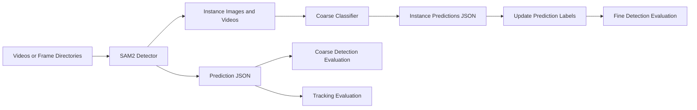

# Invasive Fishes

A vision-based perception pipeline for invasive fish detection, tracking, instance export, open-world coarse classification, and evaluation.

The project is organized around two production workflows:

- `sam2_detector`: Grounded-SAM2 based fish detection, mask tracking, instance crop/video export, and detection/tracking evaluation.
- `coarse_classifier`: image/instance-level fish classifier training and open-world inference with reference-set matching.

`FG-VLM-Dataset/` is currently treated as an auxiliary experimental workspace and is not part of the default two-stage pipeline documented below.

## Highlights

- Config-driven execution for both SAM2 detection and coarse classification.
- Video or frame-directory input support for SAM2 inference.
- Instance-level image and video export for downstream classifiers.
- Coarse and fine detection evaluation from the same SAM2 evaluation entry point.
- Self-contained coarse-classifier experiment configs for `Invasive-S2/S3/S4-A/B/C/D`.
- Optional multi-GPU training and inference through `torchrun`.

## Pipeline Overview



Evaluation behavior is controlled by `sam2_detector/evaluate_pipeline.py`:

- Without `--inference_json`, prediction labels are not updated and coarse detection evaluation is run.
- With `--inference_json`, prediction labels are updated first and fine detection evaluation is run.

## Repository Structure

```text
Invasive-fishes/
├── checkpoints/
│   ├── sam2.1_hiera_large.pt
│   └── grounding-dino-base/
├── data/
│   ├── coarse-classifier-dataset/
│   │   ├── yanghu-dataset/
│   │   ├── invasive-dataset/
│   │   └── SuppExps/
│   └── robotfish-data/
│       ├── video/
│       └── label_rectified.json
├── work_dirs/
│   ├── sam2_prediction/
│   └── coaser-classifier-ouputs/
├── sam2_detector/
│   ├── configs/default.yaml
│   ├── ground_sam2_plus_crop_instance.py
│   ├── evaluate_pipeline.py
│   ├── pipeline/
│   ├── evaluation/
│   ├── tools/
│   └── utils/
├── coarse_classifier/
│   ├── configs/
│   ├── scripts/
│   ├── tools/
│   ├── train.py
│   ├── evaluate.py
│   ├── model.py
│   ├── dataset.py
│   ├── matching.py
│   └── plots.py
└── FG-VLM-Dataset/
```

The `data/`, `checkpoints/`, and `work_dirs/` directories are expected local runtime directories. They are not intended to contain large tracked assets in the source repository.

## Installation

### Environment

Create one shared environment for both core modules:

```bash
conda create -n invasive-fish python=3.10
conda activate invasive-fish
```

Install PyTorch first. Choose the command that matches your CUDA runtime; the example below targets CUDA 12.4:

```bash
pip install torch==2.5.1 torchvision==0.20.1 torchaudio==2.5.1 --index-url https://download.pytorch.org/whl/cu124
```

Install common dependencies:

```bash
pip install opencv-python pillow numpy tqdm matplotlib transformers pyyaml
pip install scikit-learn seaborn
pip install -U huggingface_hub
```

Install SAM2 / GroundingDINO / TrackEval dependencies:

```bash
pip install git+https://github.com/IDEA-Research/Grounded-SAM-2.git
pip install git+https://github.com/IDEA-Research/GroundingDINO.git
pip install git+https://github.com/JonathonLuiten/TrackEval
```

`TrackEval` is only required for tracking evaluation. Detection inference and detection AP evaluation can still be used without it.

### Checkpoints

Place external model checkpoints under the repository-level `checkpoints/` directory:

```text
checkpoints/
├── sam2.1_hiera_large.pt
└── grounding-dino-base/
```

Recommended download workflow:

```bash
mkdir -p checkpoints

wget -O checkpoints/sam2.1_hiera_large.pt \
  https://dl.fbaipublicfiles.com/segment_anything_2/092824/sam2.1_hiera_large.pt

huggingface-cli download IDEA-Research/grounding-dino-base \
  --local-dir checkpoints/grounding-dino-base
```

The default paths are defined in `sam2_detector/configs/default.yaml`:

```yaml
runtime:
  sam2_checkpoint: "checkpoints/sam2.1_hiera_large.pt"
  grounding_model_id: "checkpoints/grounding-dino-base"
```

Run commands from the repository root so these relative paths resolve correctly.

## Data Preparation

### Expected Project Data Layout

```text
data/
├── coarse-classifier-dataset/
│   ├── yanghu-dataset/
│   ├── invasive-dataset/
│   └── SuppExps/
└── robotfish-data/
    ├── video/
    └── label_rectified.json
```

Raw videos, image datasets, annotations, and trained model weights are not included by default. Prepare them locally using the directory layout above or update the YAML configs to your own paths.

### SAM2 Detector Input

`sam2_detector` supports frame directories and video files:

```text
data/robotfish-data/video/
├── <video_name>/
│   ├── 000001.jpg
│   └── ...
├── <fish_type>/
│   └── <video_name>/
│       ├── 000001.jpg
│       └── ...
├── <video_name>.mp4
└── <fish_type>/
    └── <video_name>.mp4
```

When `.mp4` files are used, temporary frames are extracted under `<input_dir>_image` and removed after processing when `pipeline.cleanup_temp` is enabled.

Ground-truth labels for evaluation should use annotation-det style JSON:

```text
data/robotfish-data/label_rectified.json
```

The evaluation wrapper no longer accepts raw `label_rectified/*.txt` as ground truth.

### Coarse Classifier Input

The classifier expects class-structured train and validation folders:

```text
data/coarse-classifier-dataset/SuppExps/<experiment_name>/
├── train/
│   ├── brown_trout/
│   └── ...
└── val/
    ├── brown_trout/
    ├── unknown/
    └── ...
```

Build all predefined supplementary open-world splits:

```bash
python3 coarse_classifier/tools/build_dataset_suppExps.py \
  --source_root data/coarse-classifier-dataset/invasive-dataset \
  --target_root data/coarse-classifier-dataset/SuppExps
```

Files are soft-linked by default. Use `--copy` if your filesystem or deployment target requires physical copies:

```bash
python3 coarse_classifier/tools/build_dataset_suppExps.py --copy
```

Build only selected experiments:

```bash
python3 coarse_classifier/tools/build_dataset_suppExps.py \
  --experiments Invasive-S4-A Invasive-S4-D
```

Predefined splits:

```text
S2 known: brown_trout, crucian_carp
S3 known: brown_trout, crucian_carp, eastern_mosquitofish
S4 known: brown_trout, crucian_carp, eastern_mosquitofish, guppies

A unknown: largemouth_bass, mozambique_tilapia
B unknown: largemouth_bass, mozambique_tilapia, rainbow_trout
C unknown: largemouth_bass, mozambique_tilapia, rainbow_trout, grass_carp
D unknown: largemouth_bass, mozambique_tilapia, rainbow_trout, grass_carp, carp
```

`guppies` is the canonical S4 class name. The dataset builder also accepts a source folder named `guppy` for compatibility.

## Quick Start

### 1. Run SAM2 Detection, Tracking, and Instance Export

```bash
python3 sam2_detector/ground_sam2_plus_crop_instance.py
```

Use a different SAM2 config:

```bash
python3 sam2_detector/ground_sam2_plus_crop_instance.py \
  --config sam2_detector/configs/default.yaml
```

### 2. Run SAM2 Coarse Evaluation

```bash
python3 sam2_detector/evaluate_pipeline.py
```

### 3. Train the Coarse Classifier

```bash
bash coarse_classifier/scripts/train_script.sh \
  coarse_classifier/configs/invasive-s4-a.yaml \
  1
```

The second argument is the GPU count. Use `1` for a single process and a larger value to launch `torchrun`.

### 4. Run Coarse Classifier Evaluation

```bash
bash coarse_classifier/scripts/inference_script.sh \
  coarse_classifier/configs/invasive-s4-a.yaml \
  1
```

### 5. Run SAM2 Fine Evaluation with Classifier Results

```bash
python3 sam2_detector/evaluate_pipeline.py \
  --inference_json work_dirs/sam2_prediction/instance_video_results.json
```

This updates prediction `class_name` fields in `evaluation.pred_json_dir` and then runs fine-grained detection evaluation.

## Command Reference

| Task | Command |
| --- | --- |
| SAM2 inference and instance export | `python3 sam2_detector/ground_sam2_plus_crop_instance.py` |
| SAM2 coarse evaluation | `python3 sam2_detector/evaluate_pipeline.py` |
| SAM2 fine evaluation | `python3 sam2_detector/evaluate_pipeline.py --inference_json <json>` |
| Build all SuppExps datasets | `python3 coarse_classifier/tools/build_dataset_suppExps.py` |
| Train classifier | `bash coarse_classifier/scripts/train_script.sh <config> <gpu_count>` |
| Evaluate classifier | `bash coarse_classifier/scripts/inference_script.sh <config> <gpu_count>` |
| Direct classifier training | `python3 coarse_classifier/train.py --config <config>` |
| Direct classifier evaluation | `python3 coarse_classifier/evaluate.py --config <config>` |

## Configuration

The project is intentionally config-driven. Prefer editing YAML files over changing source code.

### Configuration Matrix

| File | Purpose |
| --- | --- |
| `sam2_detector/configs/default.yaml` | SAM2 runtime paths, input/output paths, detection thresholds, crop settings, pipeline switches, and evaluation defaults. |
| `coarse_classifier/configs/default.yaml` | Default self-contained classifier config for `Invasive-S4-A`. |
| `coarse_classifier/configs/invasive-s2-a.yaml` ... `invasive-s4-d.yaml` | Self-contained classifier experiment configs for predefined open-world splits. |
| `coarse_classifier/configs/class_thresholds.json` | Optional class-level decision thresholds used by classifier evaluation. |

### SAM2 Config

Key sections in `sam2_detector/configs/default.yaml`:

```yaml
runtime:
  sam2_checkpoint: "checkpoints/sam2.1_hiera_large.pt"
  grounding_model_id: "checkpoints/grounding-dino-base"

data:
  input_dir: "data/robotfish-data/video"

outputs:
  det_dir: "work_dirs/sam2_prediction/annotation_det"
  instance_image_dir: "work_dirs/sam2_prediction/instance_image"
  instance_video_dir: "work_dirs/sam2_prediction/instance_video"

detection:
  text_prompt: "fish."
  box_threshold: 0.30
  iou_threshold: 0.65
  min_edge_threshold: 100
  step: 10

pipeline:
  do_tracking: true
  do_cropping: true
  cleanup_temp: true
  enable_visualization: true

evaluation:
  pred_json_dir: "work_dirs/sam2_prediction/annotation_det"
  inference_json: null
```

`ground_sam2_plus_crop_instance.py` only accepts `--config`.

`evaluate_pipeline.py` accepts `--config` and optional `--inference_json`; all other evaluation options come from YAML.

### Coarse Classifier Configs

Each classifier experiment YAML is complete and can be used independently:

```text
coarse_classifier/configs/
├── default.yaml
├── invasive-s2-a.yaml
├── invasive-s2-b.yaml
├── invasive-s2-c.yaml
├── invasive-s2-d.yaml
├── invasive-s3-a.yaml
├── invasive-s3-b.yaml
├── invasive-s3-c.yaml
├── invasive-s3-d.yaml
├── invasive-s4-a.yaml
├── invasive-s4-b.yaml
├── invasive-s4-c.yaml
└── invasive-s4-d.yaml
```

Each file includes:

- `experiment`: experiment name.
- `data`: train, validation, and reference directories.
- `outputs`: checkpoint and evaluation output paths.
- `training`: training hyperparameters.
- `inference`: evaluation and open-world screening hyperparameters.

## Outputs

### SAM2 Outputs

Default output root:

```text
work_dirs/sam2_prediction/
├── annotation_det/
│   └── perdiction.json
├── annotation_mask/
├── masked_image/
├── masked_video/
├── instance_image/
│   └── <video_name>_<instance_id>_<frame_id>.webp
└── instance_video/
    └── <video_name>_<instance_id>.mp4
```

`perdiction.json` is the legacy project filename for aggregated prediction annotations.

### SAM2 Evaluation Outputs

Default output root:

```text
work_dirs/sam2_prediction/kitti_eval_run/
├── evaluation_report.json
├── evaluation_report.txt
├── detection_summary.json
├── detection_frame_map.csv
├── prediction_update_summary.json
└── tracking_results/
```

`prediction_update_summary.json` is only produced when `inference_json` is provided.

### Coarse Classifier Outputs

The default output directory follows the experiment config:

```text
work_dirs/coaser-classifier-ouputs/<experiment_name>/
├── fish_classifier_epoch_<epoch>.pth
├── fish_classifier_best_epoch_<epoch>_loss_<loss>.pth
└── evaluation/
    ├── evaluation_summary.json
    ├── detailed_predictions.json
    └── figures...
```

The `coaser-classifier-ouputs` spelling is retained for compatibility with the current project layout.

## License

License information should be added before public release.

## Citation

Citation information should be added before public release. If this repository is used in academic work, please cite the associated paper or project once available.

## Acknowledgements

This project builds on SAM2, GroundingDINO, PyTorch, Transformers, and TrackEval. Please also follow the licenses and citation requirements of those upstream projects.
